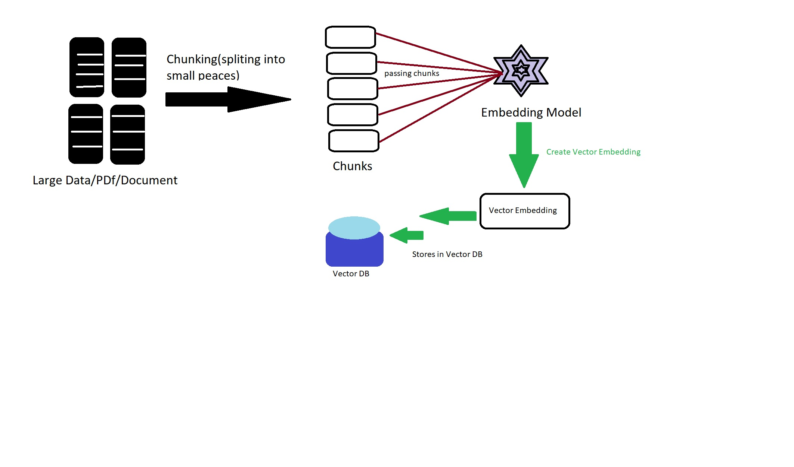
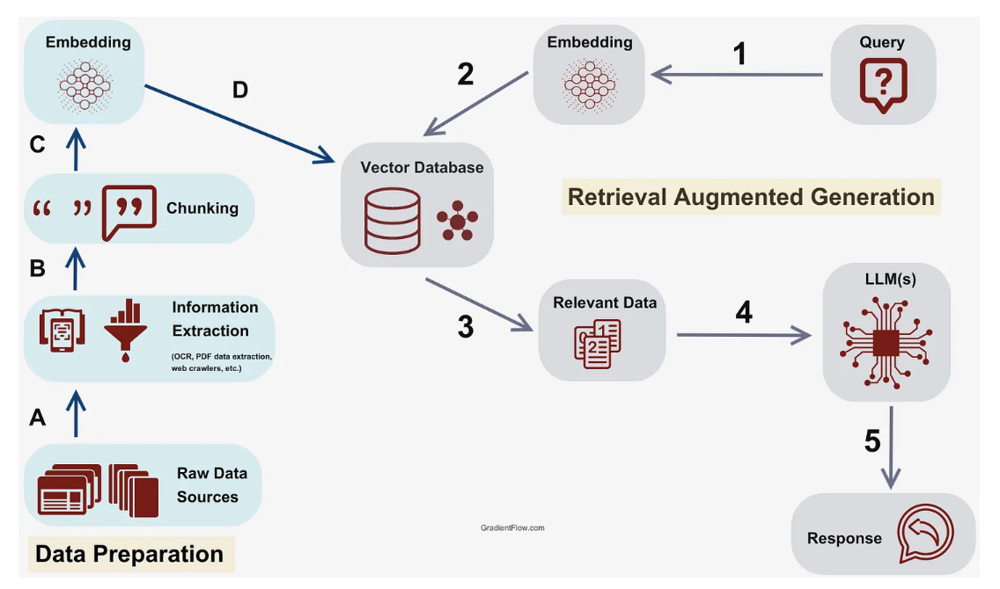

# RAG - Retrieval Augmented Generation :
- It is an **AI Framework** that **combinesthe** strenght of llm with **External Knowledge Source**.

## RAG has two Phases :
- indexing phase = provides the data
- Retrieval phase = chatting with data

### Indexing phase :
- <mark>**Chunking**</mark> = Spliting large data into smaller chunks/peaces,for every chunks we pass to Embedding model which creates Vector Embedding ,then we store in the Vector DB.

- In the Vector DB ,we can have meta data(page no,doc info),content.





### Retrieval phase :
- In the Retrieval phase user **gives Query** to **Embedding Model**,then it **Checks** in the **Vector DB**, if the **relevant data present**,the it gives the **output** to **LLM** then **LLM Response**as an **OUTPUT**.

## Different loaders for Different Requirements/import statements :


## Note 1 : Make sure you are using a ***correct import statement** and **correct extension**.

### Basic Example to Import correct Import statements and Extension :
- **For PDF**
```
# For PDF
from langchain.document_loaders import PyPDFLoader

loader = PyPDFLoader("path/to/file.pdf")
documents = loader.load()
```

- **For Word (DOCX)**
```
from langchain.document_loaders import Docx2txtLoader

loader = Docx2txtLoader("path/to/file.docx")
documents = loader.load()
```

- **For Plain Text**
```
from langchain.document_loaders import TextLoader

loader = TextLoader("path/to/file.txt")
documents = loader.load()

```

## Note 2 : In the next md file we have example in depth about both Indexing and Retrieval.