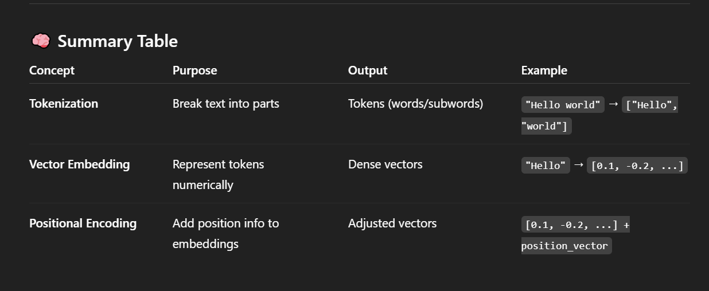

## note :
- To understand posioning encoding , let's understand what is **vector Embedding** and **Tokenization** -

# Vector Embedding :
- It is a **numerical representation of a token/data**.

## Purpose :
- Allows models to understand similarity, context, and meaning.

# Tokenization :
- It is a process of **converting raw text into numbers**.

## Why it's needed :
- **Models don't understand raw text — they need numbers and tokenization** is the first step toward converting text into numerical form.

# Posioning Encoding :
- It's a way of **adding position information to each token in the input sequence**.

