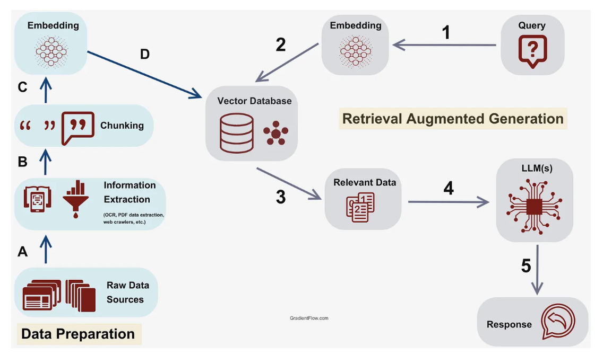

# Indexing phase :
- <mark>**Chunking**</mark> = Spliting large data into smaller chunks/peaces,for every chunks we pass to Embedding model which creates Vector Embedding ,then we store in the Vector DB.

- In the Vector DB ,we can have meta data(page no,doc info),content.

## Notes : Important Rules
- To run indexing and retireval phase we should run(connect) the docker in the backend.

- For Vector DB i used Qdrant with Docker.
- **connect your Qdrant with Docker that's it**.
- **pull the Qrant or anything from .yml file.**
```
docker compose up -d
```
- **Create a file called docker-compose.yml.**
```
version: "3.8"
services:
  qdrant:
    image: qdrant/qdrant  # to connect the Qdrant db with Docker
    ports:
      - "6333:6333"
    volumes:
      - ./qdrant_storage:/qdrant/storage
```



## Example on Indexing :
- Here we are dealing with **pdf**.
```
from dotenv import load_dotenv

from pathlib import Path
from langchain_community.document_loaders import PyPDFLoader
from langchain_text_splitters import RecursiveCharacterTextSplitter
from langchain_openai import OpenAIEmbeddings
from langchain_qdrant import QdrantVectorStore
import os

load_dotenv()

# taking pdf by providing correct path
pdf_path = Path(__file__).parent / "nodejs.pdf"

# Load this file in python program
loader = PyPDFLoader(file_path=pdf_path)
docs = loader.load()

# Split the docs into smaller chunks
text_splitter = RecursiveCharacterTextSplitter(
    chunk_size=1000,
    chunk_overlap=400
)

chunks = text_splitter.split_documents(documents=docs)

# Vector Embeddings
embedding_model = OpenAIEmbeddings(
    model="text-embedding-3-large",
    api_key=os.getenv("OPEN_API_KEY")
)

vector_store = QdrantVectorStore.from_documents(
    documents=chunks,
    embedding=embedding_model,
    url="http://localhost:6333",
    collection_name="learning_rag"
)

print("Indexing of documents done....")

# url for qdrant dashboard
# http://localhost:6333/dashboard#/collections
```