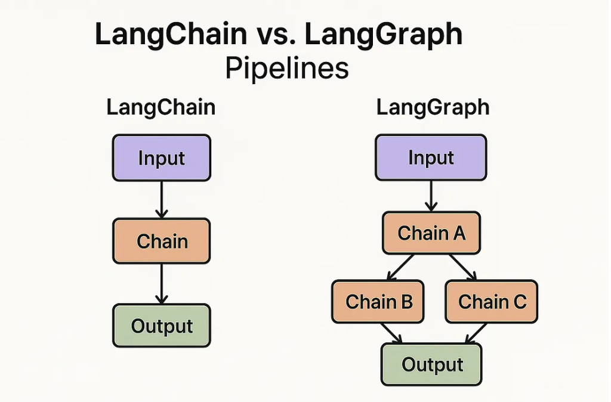

# LangGrph :
- LangGraph is a framework for building more reliable, maintainable, and flexible AI agent/workflow systems using graph‑based orchestration, strong support for state, human oversight, durability.

- LangGraph is a recently developed framework by LangChain (makers of LangChain) aimed at building more powerful, reliable, and flexible AI agents and workflows.

- LangGraph is built on top of LangChain, but adds something powerful: memory and loops.

## It helps you :
- **You can loop through steps.**

- **You can go back, try again, or decide based on previous output.**

- **It’s more like building a brain flowchart than a straight path.**

## Example :
### Imagine a chatbot that keeps asking for clarification until it fully understands your question.
- In LangChain, this is hard.
- In LangGraph, it’s easy — you just create a loop node:
- Ask → Understand → (If not clear → Ask again) → Answer

## LangGraph has 2 things which helps in **workflow** :
### Nodes :
- Nodes are **function** which performs specific task.

### Edges :
- Edges is used To **make connection with nodes**.

