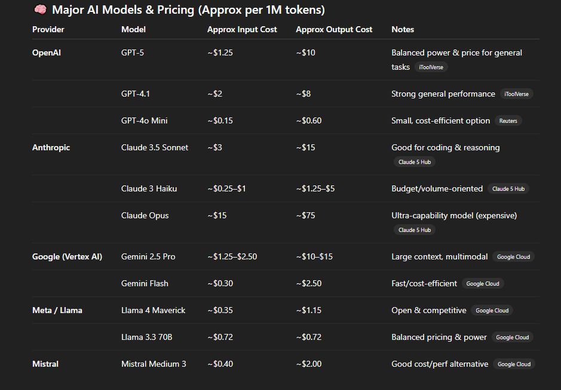
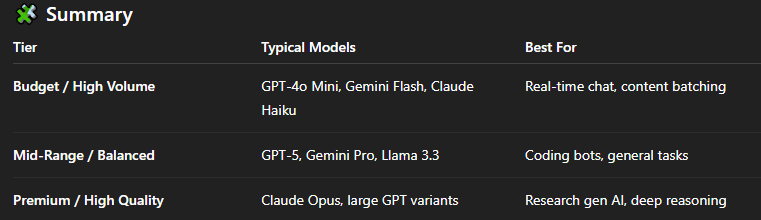
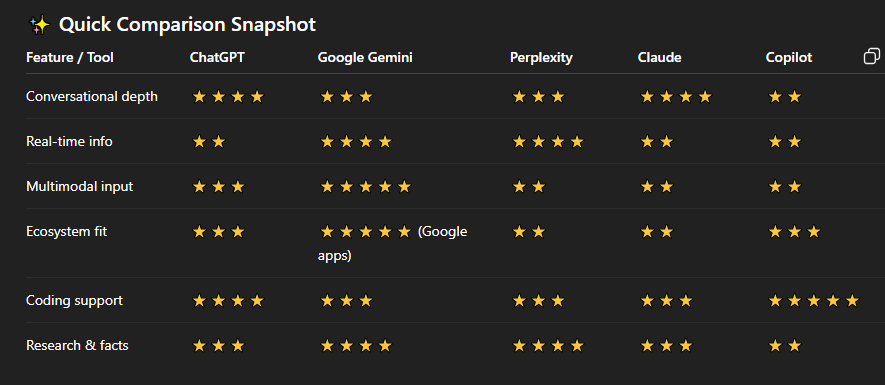

# Models and its Pricing :
- Most Gen-AI API's charge based on **Tokens**.

## Example :
- Input tokens (what you send to the model)

- Output tokens (what the model generates)

## Token :
- It's piece of text, like a word or part of a word.

### Example :
- “Hello” → 1 token

- “ChatGPT is awesome!” → 5 tokens: Chat, G, PT, is, awesome! (roughly)

- “Unbelievable” → might be split into Un, believable → 2 tokens

## Why APIs Charge by Tokens :

- Generative AI models don’t just count words—they process tokens internally:

 **1. Input tokens :** what you send to the model (prompt, instructions, context).

 **2. Output tokens :** what the model generates (response, text, code).

### Example:

**1. Prompt :** “Write a 100-word summary of climate change.” → maybe ~150 tokens input

**2. Model response :** 100-word summary → maybe ~130 tokens output

**3. Total billed tokens :** 150 + 130 = 280 tokens

### APIs charge per 1 million tokens, not per word, because that matches how much computation the model actually does.

# 1️⃣ When you have large documents (PDFs, reports, manuals, contracts) :
## ❌ What not to do :

- Don’t send the entire document to the model every time

- It’s expensive, slow, and often hits context window limits

### Best practice : RAG (Retrieval-Augmented Generation)

- This is the industry standard.

**How it works (simple) ->**

1. Split documents into small chunks (e.g., 500–1,000 tokens)

2. Convert chunks into embeddings

3. Store them in a vector database

**4. For each question :**

- Retrieve only the most relevant chunks

- Send those chunks + the question to the LLM

**Tools commonly used :**

- Vector DBs: Pinecone, FAISS, Weaviate, Chroma

Models: GPT-4o Mini, GPT-5, Claude Sonnet, Gemini Flash

**✅ Advantage :**

- Handles very large datasets

- Much cheaper

- Faster

- More accurate

## 2️⃣ When you need to process very long context in one go :
- Some models support huge context windows (hundreds of thousands to 1M tokens).

### Best options :

- Gemini Pro / Gemini 2.5 → very large context.

- Claude Sonnet / Opus → strong long-document reasoning.

- GPT models with extended context.

## Note :
- 👉 RAG is the default solution for large or multiple documents.
- 👉 Long-context models are for special cases.
- 👉 Never brute-force huge data into a prompt.

