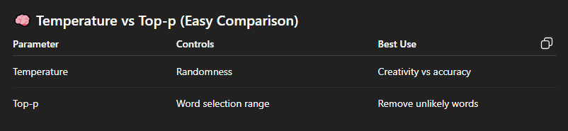
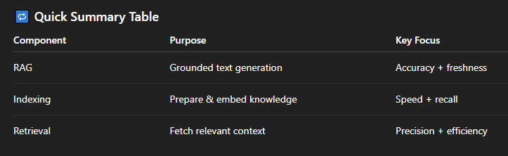
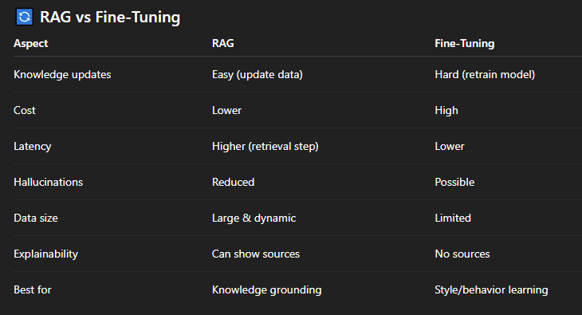

# Interview Question on Geni-AI :
## 1. What is Generative AI?
### Concept:
- Generative AI refers to models that can create new content (text, images, code, audio, video) rather than just analyze existing data.
- Examples: ChatGPT (text), DALL·E (images), Copilot (code).

## 2. How is Generative AI different from traditional AI?
### Concept:

- Traditional AI → focuses on prediction, classification, or rules

- Generative AI → focuses on creating new data similar to training data

- **Example**:
- Traditional AI detects spam.
- Generative AI writes an email.

## 3. What are Large Language Models (LLMs)?

### Concept:
- LLMs are deep learning models trained on massive text datasets to understand and generate human-like language.
They use transformer architecture and self-attention.

- **Examples**: GPT, LLaMA, Claude.

## 4. What is a transformer model?
### Concept:
A transformer is a neural network architecture that:

- Processes data in parallel

- Uses self-attention to understand context

- Scales efficiently for large datasets

- This is the backbone of most GenAI models.

## 5. What is prompt engineering?
### Concept:
- Prompt engineering is the practice of designing effective inputs to guide a GenAI model toward better outputs.

**Example techniques:**

- Clear instructions

- Few-shot examples

- Role-based prompts

## 6. What is hallucination in Generative AI?
### Concept:
- Hallucination occurs when a model generates confident but incorrect or fabricated information.

**Mitigation:**

- Grounding with trusted data

- Retrieval-Augmented Generation (RAG)

- Human review

## 7. What is fine-tuning?
### Concept:
- Fine-tuning means training a pre-trained GenAI model on domain-specific data to improve performance for a particular task (e.g., legal, medical, customer support).

## 8. What is RAG (Retrieval-Augmented Generation)?
### Concept:
**RAG combines :**
- Information retrieval (from documents or databases)

- Generative models

- This allows the model to generate fact-based, up-to-date answers.

## 9. What are some real-world applications of GenAI?
### Concept / Examples:

- Chatbots & virtual assistants

- Code generation

- Content creation

- Drug discovery

- Personalized learning

- Customer support automation

## 10. What are the limitations of Generative AI?
### Concept:

- Hallucinations

- Bias in training data

- High computational cost

- Data privacy concerns

- Lack of true reasoning or consciousness

## 11. How do you ensure ethical use of GenAI?
### Concept:

- Bias detection & mitigation

- Transparency & explainability

- Data privacy protection

- Human-in-the-loop systems

- Responsible AI guidelines

## 12. What is temperature in GenAI models?
### Concept:
- Temperature controls randomness:

- Low temperature → more deterministic, factual

- High temperature → more creative, diverse outputs

## 2. How does Generative AI work?
### Answer:
- Generative AI models are trained on large datasets using deep learning.

## 7. What is hallucination in GenAI?
### Answer:
- Hallucination happens when a GenAI model produces incorrect or made-up information confidently.

- This occurs because the model predicts words based on probability, not actual understanding.

## 8. 1️⃣ Temperature (controls randomness) ?

- **Temperature controls how random or creative the model’s output is...**

 1. Low temperature (0–0.3) → More factual, predictable

2. Medium temperature (0.5–0.7) → Balanced

3. High temperature (0.8–1.0) → More creative, varied

## Example (Same question, different temperatures)

**Prompt :** “Describe the sun.”

**🔸 Low Temperature (0.2) -**
- “The sun is a star at the center of the solar system that provides light and heat.”

- ✔️ Very factual
- ❌ Not creative

**🔸 Medium Temperature (0.6) -**
- “The sun is a bright star at the center of our solar system that gives energy and supports life on Earth.”

- ️ Balanced
- ✔️ Interview-safe

**🔸 High Temperature (0.9) -**
- “The sun is a blazing golden fireball painting the sky with warmth and life.”

- ✔️ Creative
- ❌ Risk of hallucination

## 2️⃣ Top-p (controls word choice range) :
- Top-p limits the model to choose words only from the most probable ones whose total probability is p.

- Top-p = 0.9 → Choose from top 90% most likely words

- Lower top-p → Safer and more focused answers

## RAG :
### Advantages :
- **Up-to-date knowledge :** Can use external data without retraining the model.

- **Reduced hallucinations :** Answers are grounded in retrieved documents.

- **Faster queries :** Preprocessing enables quick retrieval at inference time.

- **Reusable structure :** Index can be reused across multiple applications.

- **Relevant context selection :** Only the most useful documents are sent to the LLM.

- **Lower token usage :** Reduces prompt size and inference cost.

### Drawbacks :
- **Not fully reliable(Hallucination) :** Still possible to hallucinate if retrieval fails.

- **Dependency on data quality :** Poor data → poor answers.

- **Chunking challenges :** Poor chunking reduces retrieval accuracy.

- **Storage cost :** Vector databases can be expensive.

- **Retrieval errors :** Relevant documents may not be retrieved.

## Use Cases :
- **Customer support chatbots.**
- **Code documentation and developer help.**

## 🟢 When to Use What?(RAG or Fine-tuning)
- **You need factual accuracy(use RAG).** 

- **You want consistent tone/style(use Fine-Tuning).**

### Fine-tune for behavior + RAG for knowledge.